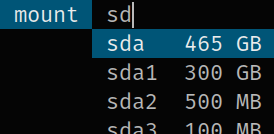

# haskell-dmenu-pmount
Mounting and unmounting linux devices as a user with `dmenu` and `pmount`.

Runtime Dependencies:
  [dmenu](http://tools.suckless.org/dmenu/) or
  [dmenu2](https://bitbucket.org/melek/dmenu2), and
  [pmount](https://linux.die.net/man/1/pmount).

Installation:
  Either get the sources from this repository, or
  [from hackage](https://hackage.haskell.org/package/dmenu-pmount).

Usage:

*   `dmenu-pmount [OPTIONS] [-- DMENUOPTIONS]`

    Spawns a dmenu process to let the user select devices from `/dev` to
    mount with `pmount` or unmount with `pumount`.
    
    All arguments, after the first `--` argument, are directly passed to `dmenu`.

Options:

*   `-u, --unmount`

    Unmount instead of mount devices.
*   `-f, --filter <DevPrefixList>`

    Only display devices whose filenames have a certain prefix.
    
    Example: `dmenu-pmount -f sd cdrom` only displays devices beginning with
             `sd` or `cdrom`, e.g. `/dev/sda2`.
*   `-k, --kilo <Natural>`

    How much byte are represented by 1 KB? Usually 1024 (default) or 1000.

The application is build with the
[dmenu Haskell bindings](https://hackage.haskell.org/package/dmenu), which
support customizing the dmenu commandline options in a configuration file.

